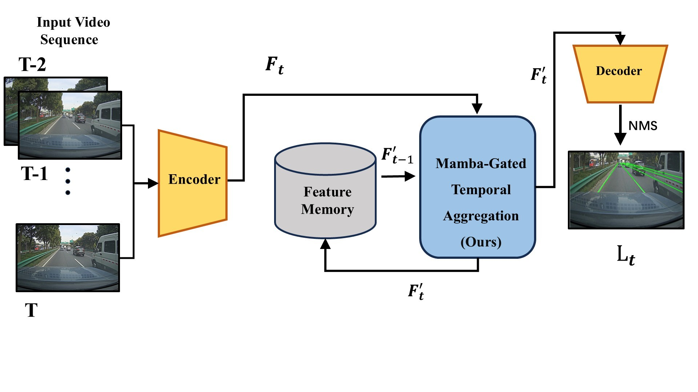

# GTM-Lane

**Spatial Mamba and Dual-Gated Aggregation for Video Lane Detection**

### Chen Xinying, Zhang Jiran, and Zhang Xiao

Dalian Jiaotong University, School of Rail Intelligent Engineering

Official implementation for **"GTM-Lane: Spatial Mamba and Dual-Gated Aggregation for Video Lane Detection"**.





## :postal_horn: Getting Started

### Step 1: Clone the Repository
```
$ git clone https://github.com/jiranzhang316-droid/GTM-Lane.git
$ cd GTM-Lane
```

### Step 2: Download Preprocessed Data
Download the [preprocessed data](https://drive.google.com/file/d/14JI2BIwJ677_rCBLGQiHvl6IF-n0LIwH/view) into the ROOT directory:
```
$ cd ROOT
$ unzip preprocessing.zip
```
### Step 3: Set Up Environment
Create and activate a new conda environment:
```
$ conda create -n GTMLane python=3.7 anaconda
$ conda activate GTMLane
```
### Step 4: Install Dependencies
```
$ conda install pytorch==1.10.0 torchvision==0.11.0 torchaudio==0.10.0 cudatoolkit=10.2 -c pytorch
$ pip install -r requirements.txt
```
Pytorch can be installed on [here](https://pytorch.org/get-started/previous-versions/). Other versions might be available as well.

### Step 5: Dataset Preparation
Download [OpenLane-V](https://drive.google.com/file/d/1Jf7g1EG2oL9uVi9a1Fk80Iqtd1Bvb0V7/view?usp=sharing) into the original OpenLane dataset directory. VIL-100 can be downloaded in [here](https://github.com/yujun0-0/MMA-Net).

#### :bookmark_tabs: Preprocessing
You can obtain the preprocessed data by running the code in the Preprocessing directories. The data preprocessing is divided into several steps, each of which is described in detail below.
1. In P00, the type of ground-truth lanes in a dataset is converted to pickle format. (only for VIL-100)
2. In P01, each lane in a training set is represented by 2D points sampled uniformly in the vertical direction.
3. In P02, a lane matrix is constructed and SVD is performed. Then, each lane is transformed into its coefficient vector.
4. In P03, video-based datalists are generated for training and test sets.

```
$ cd ROOT/Preprocessing/DATASET_NAME/PXX_each_preprocessing_step/code/
$ python main.py --dataset_dir /your_dataset_path 
```

    
### Directory structure
    .                           # ROOT
    ├── Preprocessing           # directory for data preprocessing
    │   ├── VIL-100             # dataset name (VIL-100, OpenLane-V)
    |   |   ├── P00             # preprocessing step 1
    |   |   |   ├── code
    |   |   ├── P01             # preprocessing step 2
    |   |   |   ├── code
    │   └── ...                 # etc.
    ├── Modeling                # directory for modeling
    │   ├── VIL-100             # dataset name (VIL-100, OpenLane-V)
    |   |   ├── ILD_seg         # a part of ILD for predicting lane probability maps
    |   |   |   ├── code
    |   |   ├── ILD_coeff       # a part of ILD for predicting lane coefficient maps
    |   |   |   ├── code
    |   |   ├── PLD             # PLD
    |   |   |   ├── code
    |   |   ├── ZJR_SND         # GTM-Lane (proposed)
    |   |   |   ├── code
    │   ├── OpenLane-V           
    |   |   ├── ...             # etc.
    ├── pretrained              # pretrained model parameters 
    │   ├── VIL-100              
    │   ├── OpenLane-V            
    │   └── ...                 # etc.
    ├── preprocessed            # preprocessed data
    │   ├── VIL-100             # dataset name (VIL-100, OpenLane-V)
    |   |   ├── P00             
    |   |   |   ├── output
    |   |   ├── P02             
    |   |   |   ├── output
    │   └── ...
    .
    .                           
    ├── OpenLane                # dataset directory
    │   ├── images              # Original images
    │   ├── lane3d_1000         # We do not use this directory
    │   ├── OpenLane-V
    |   |   ├── label           # lane labels formatted into pickle files
    |   |   ├── list            # training/test video datalists
    ├── VIL-100
    │   ├── JPEGImages          # Original images
    │   ├── Annotations         # We do not use this directory
    |   └── ...

## Train
Set the dataset you want to train on (`DATASET_NAME`), and then parse your dataset path into the `-dataset_dir` argument.
```
$ cd ROOT/Modeling/DATASET_NAME/code/
$ python main.py --run_mode train --pre_dir ROOT/preprocessed/DATASET_NAME/ --dataset_dir /your_dataset_path 
```
 
## Test
Set the dataset you want to train on (`DATASET_NAME`), and then parse your dataset path into the `-dataset_dir` argument.
```
$ cd ROOT/Modeling/DATASET_NAME/code/
$ python main.py --run_mode test --pre_dir ROOT/preprocessed/DATASET_NAME/ --dataset_dir /your_dataset_path 
```

## Evaluation (on VIL-100)
To evaluate on VIL-100, you'll need to install the official CULane evaluation tools. The official metric implementation is available [here](https://github.com/yujun0-0/MMA-Net/blob/main/INSTALL.md). Download the tools into `ROOT/Modeling/VIL-100/code/evaluation/culane/` and compile them. We recommend to see an [installation guideline](https://github.com/yujun0-0/MMA-Net/blob/main/INSTALL.md).
```
$ cd ROOT/Modeling/VIL-100/code/evaluation/culane/
$ make
```


## :green_book: Citation

If you find our work useful for your application, please cite the following:
```
@misc{gtm-lane,
      title={GTM-Lane: Spatial Mamba and Dual-Gated Aggregation for Video Lane Detection}, 
      author={Chen Xinying and Zhang Jiran and Zhang Xiao},
      year={2025},
}
```


## :wrench: Model weights
You can download our model weights [here](https://pan.baidu.com/s/1_q-AZOGyabeFoY4Q_aq3vg?pwd=6nak) (code:6nak) into the ROOT directory:

```
$ cd ROOT
$ unzip pretrained.zip
```

## :rose: Acknowledge
We express our gratitude to the authors for their outstanding work [Recursive Video Lane Detection](https://github.com/dongkwonjin/RVLD).
